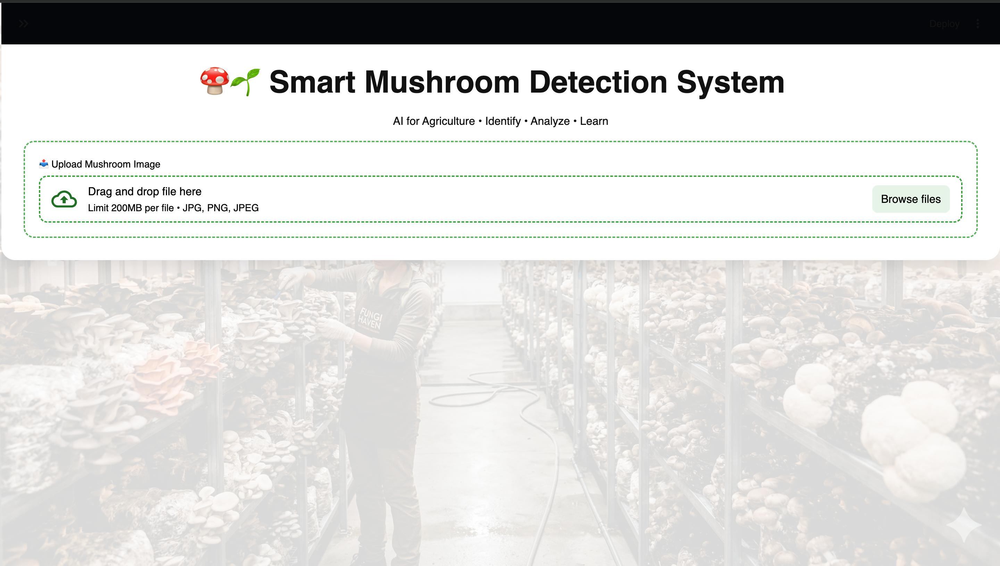

# 🍄 Mushroom Detection & Classification App (YOLO + Streamlit)


---

## 📌 Overview
This project is an **AI-powered Mushroom Detection & Classification System** built using a YOLO-based deep learning model and deployed with Streamlit.

It helps users:
- Identify different types of mushrooms
- Understand their properties
- View cultivation details and market price

---

## 📄 Research Paper
This project is inspired by the IEEE conference paper:

**Detection and Classification of Edible Mushrooms Using Deep Learning Model YOLOv12s for Market Authentication**

📍 Published in:  
2025 IEEE UP Section WIE International Conference (UPWIECON)

🔗 https://ieeexplore.ieee.org/document/11390139

---

## 🚀 Features

- 📤 Upload mushroom image  
- 🤖 AI-based detection using YOLO model  
- 🌱 Cultivation information  
- 🥗 Nutritional details  
- 💰 Monthly price insights (₹/kg)  
- 🌐 Multi-language support (English + Hindi)  
- 🎨 Modern agriculture-themed UI  

---

## 🖼️ Demo

### 🏠 Home Page


---

## ⚙️ Tech Stack

- Python  
- Streamlit  
- YOLO (Ultralytics)  
- PyTorch  
- OpenCV  

---

## 📂 Project Structure
mushroom-detection-streamlit/
│── app.py
│── model/
│ └── mushroom_model.pt
│── static/
│ └── images/
│ └── bg.png
│── mushroom_info.json
│── requirements.txt
│── README.md


---

## ⚡ Setup & Run Locally

### 1. Create Virtual Environment
```bash
python -m venv .venv
source .venv/bin/activate   # Mac/Linux
.venv\Scripts\activate      # Windows


2. Install Dependencies

pip install -r requirements.txt
3. Add Model

Place your trained model inside:model/mushroom_model.pt
4. Run App
streamlit run app.py

Open in browser:

http://localhost:8501

🌐 Deployment

This app can be easily deployed on:

Streamlit Cloud

Render

👨‍💻 Author

Sachin Ranjan
B.Tech CSE, Quantum University

🔗 GitHub: https://github.com/Sachinranjan1905